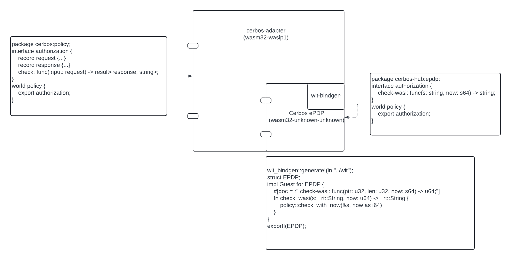

# wit-adapter

This repository contains a DRAFT version of [Cerbos EPDP WIT interface](wit/policy.wit).
The interface uses rich types while the existing [Cerbos EPDP interface](./workspace/wit/host.wit) manipulates strings.

[Cerbos](https://github.com/cerbos/cerbos) is an open-core, language-agnostic, scalable authorization solution that simplifies user permissions and authorization by writing context-aware access control policies for application resources.

Cerbos service is a policy decision point (PDP).
This repository deals with embedded Cerbos PDP (ePDP) - a free tier feature of [Cerbos Hub](https://hub.cerbos.cloud/).

ePDP is built from required set policies as a self-contained program, which implements the same [CheckResources API](https://docs.cerbos.dev/cerbos/latest/api/#check-resources).
Technically, we transpile policies to Rust code and compile it to WebAssembly (core module). A wall clock `now` function is the only dependency ePDP has on the host.
```rust
#[link(wasm_import_module = "env")]
extern "C" {
    #[link_name = "now"]
    fn now() -> u64;
}
```

In the original use case, ePDPs are used in single-page applications and are meant to be used via [Cerbos JavaScript SDK](https://github.com/cerbos/cerbos-sdk-javascript/blob/main/packages/embedded/README.md).
ePDP API is effectively a function `fn check(input: String) -> String`, except that the SDK needs to allocate/deallocate memory for the strings. The SDK converts these strings (JSON serialization) to rich types, which are then exposed to the SPA.

Here, we explored converting a Wasm core module binary to a Wasm component. 
NOTE: We are not building a component for the required set of policies, at least for now.


In the following `justfile` we do:
1. build the ePDP as usual.
2. build a stub for the wall clock `now` function to satisfy the wasm module import. (We can’t yet convert a module import to a component import, which would be the ideal solution)
3. link the ePDP module with the stub module and create a component.

⚠️ This `justfile` is given only for the reference. It can't be run in the repo.
```justfile
policy_wasi := "policy-wasi.wasm"
target_arch_os := "wasm32-unknown-unknown"
target := join(justfile_directory(), "target", target_arch_os, "release", "policy.wasm")

link: build build-now-stub
    wasm-tools component new {{ target }} -o {{ policy_wasi }} --adapt ./env.wasm

build:
    cargo build --release --target {{ target_arch_os }}

build-now-stub:
    #!/usr/bin/env bash
    rustc -o env.wasm --target {{ target_arch_os }} --crate-type cdylib --edition=2021 \
     -C opt-level=z -C lto -C codegen-units=1 -C debuginfo=0  - <<EOF
    #[no_mangle]
    pub unsafe extern "C" fn now() -> u64 { 0 }
    EOF
```

# Diagram
The `cerbos-adapter` component imports the interface of the Cerbos ePDP component, encoded from the (Wasm Core module).

