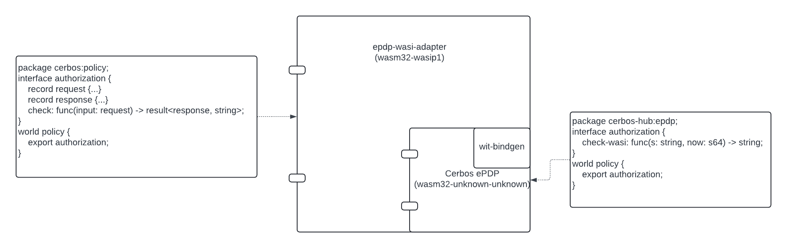

# wit-adapter

This repository contains a DRAFT version of [Cerbos EPDP WIT interface](wit/policy.wit).
The interface uses rich types while the existing [Cerbos EPDP interface](./workspace/wit/host.wit) manipulates strings.

[Cerbos](https://github.com/cerbos/cerbos) is an open-core, language-agnostic, scalable authorization solution that simplifies user permissions and authorization by writing context-aware access control policies for application resources.

Cerbos service is a policy decision point (PDP).
This repository deals with embedded Cerbos PDP (ePDP) - a free tier feature of [Cerbos Hub](https://hub.cerbos.cloud/).

ePDP is built from required set policies as a self-contained program, which implements the same [CheckResources API](https://docs.cerbos.dev/cerbos/latest/api/#check-resources).
Technically, we transpile policies to Rust code and compile it to WebAssembly (core module). A wall clock `now` function is the only dependency ePDP has on the host.

In the original use case, ePDPs are used in single-page applications and are meant to be used via [Cerbos JavaScript SDK](https://github.com/cerbos/cerbos-sdk-javascript/blob/main/packages/embedded/README.md).
ePDP API is effectively a function `fn check(input: String) -> String`, except that the SDK needs to allocate/deallocate memory for the strings. The SDK converts these strings (JSON serialization) to rich types, which are then exposed to the SPA.

Here we explored what it takes to convert a Wasm core module binary to a Wasm component. 
NOTE: We are not building a component for the required set of policies, at least for now.

`./workspace/justfile` is provided only for the reference. It compiles Cerbos ePDP as a core module, generates a stub for a module import, and creates a component.

# Diagram
The `cerbos-adapter` component imports the interface of the Cerbos ePDP component, encoded from the (Wasm Core module).

